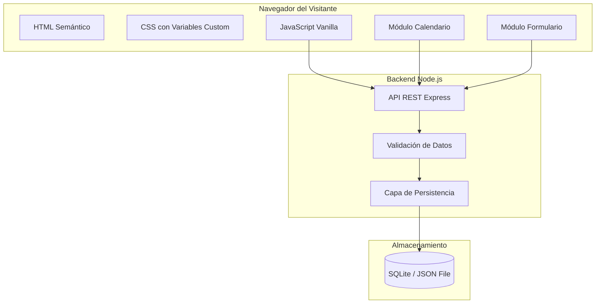
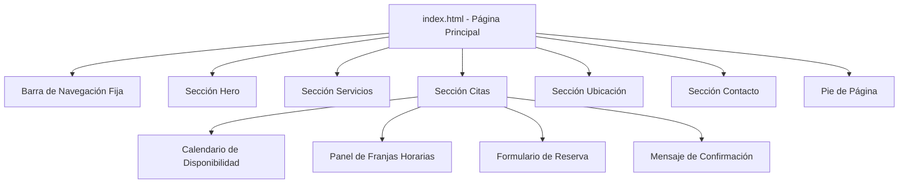
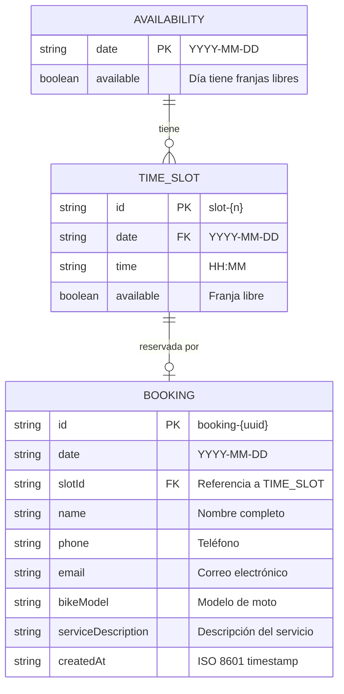

# Documento de Diseño — RadikalBikesRace Website

## Resumen

Este documento describe el diseño técnico del sitio web de RadikalBikesRace, un taller de motos ubicado en Torrejón de la Calzada, Madrid. El sitio será una aplicación web de página única (SPA) construida con HTML semántico, CSS moderno y JavaScript vanilla — sin frameworks ni dependencias externas. Incluye un sistema de reserva de citas con calendario de disponibilidad y formulario de reserva, respaldado por un backend ligero con Node.js y una base de datos JSON o SQLite para persistencia.

La estética del sitio refleja la identidad del taller: colores oscuros, texturas industriales y tipografías con carácter mecánico, evitando deliberadamente el aspecto genérico de plantillas generadas por IA.

## Arquitectura

### Visión General

El sistema sigue una arquitectura cliente-servidor simple:



### Decisiones de Arquitectura

1. **HTML/CSS/JS Vanilla sin frameworks**: El sitio es una landing page sencilla. Usar React, Vue o similar sería sobreingeniería. Vanilla JS mantiene el bundle mínimo y la carga rápida (<3s requerido).

2. **Backend Node.js con Express**: Necesario para el sistema de citas (Requisito 10). Un backend ligero gestiona la disponibilidad, valida reservas y persiste datos. Se eligió Node.js por simplicidad y porque permite usar JavaScript en todo el stack.

3. **SQLite como base de datos**: Ideal para un taller pequeño. Sin necesidad de configurar un servidor de base de datos separado. El archivo SQLite se almacena junto al servidor. Alternativa: archivo JSON para máxima simplicidad en desarrollo.

4. **CSS Custom Properties para tematización**: Permite definir la paleta de colores oscuros y el estilo industrial en un solo lugar, facilitando ajustes futuros.

5. **Scroll suave nativo con CSS**: `scroll-behavior: smooth` en lugar de librerías JavaScript para la navegación entre secciones.

## Componentes e Interfaces

### Estructura de Componentes del Frontend



### 1. Barra de Navegación (`nav.js`)

Componente de navegación fija en la parte superior.

- **Comportamiento**: Permanece fija (`position: sticky`) durante el scroll
- **Contenido**: Logo pequeño + enlaces a cada sección (Hero, Servicios, Citas, Ubicación, Contacto)
- **Responsive**: En móvil se colapsa en menú hamburguesa
- **Interacción**: Click en enlace → scroll suave a la sección correspondiente

```javascript
// Interfaz conceptual
function initNavigation() {
  // Registra event listeners en los enlaces de navegación
  // Implementa scroll suave a las secciones
  // Gestiona el menú hamburguesa en móvil
}
```

### 2. Sección Hero (`hero section`)

Área principal de impacto visual al cargar la página.

- **Contenido**: Logo PNG (proporcionado por cliente), nombre "RadikalBikesRace", eslogan
- **Layout**: Centrado vertical y horizontal, min-height: 80vh
- **Responsive**: Logo y tipografía se escalan proporcionalmente en móvil
- **Fondo**: Imagen oscura con overlay o textura industrial

### 3. Sección Servicios (`services section`)

Grid de tarjetas con los servicios del taller.

- **Servicios**: Mantenimiento general, Reparación de motor, Diagnóstico, Preparación de motos, Personalización
- **Layout**: Grid de 3 columnas en desktop, 2 en tablet, 1 en móvil
- **Cada tarjeta**: Icono SVG + título + descripción breve
- **Estilo**: Bordes sutiles, hover con efecto de elevación, fondo ligeramente más claro que el body

### 4. Sección Citas — Calendario de Disponibilidad (`calendar.js`)

Componente principal del sistema de reservas. Implementado en JavaScript vanilla.

```javascript
// Interfaz del módulo de calendario
const CalendarModule = {
  // Inicializa el calendario con el mes actual
  init(containerId: string): void,

  // Obtiene disponibilidad del servidor para un mes dado
  async fetchAvailability(year: number, month: number): Promise<DayAvailability[]>,

  // Renderiza el calendario con indicadores de disponibilidad
  render(availability: DayAvailability[]): void,

  // Maneja selección de día
  onDaySelect(callback: (date: string) => void): void,

  // Navega al mes anterior/siguiente
  navigateMonth(direction: -1 | 1): void
};
```

**Comportamiento**:
- Muestra un calendario mensual con navegación entre meses
- Días con disponibilidad: resaltados con color de acento
- Días sin disponibilidad: atenuados, no seleccionables
- Fechas pasadas: deshabilitadas visualmente y no interactivas
- Al seleccionar un día: carga y muestra las franjas horarias disponibles

### 5. Sección Citas — Panel de Franjas Horarias (`timeSlots.js`)

Muestra las franjas horarias disponibles para el día seleccionado.

```javascript
// Interfaz del módulo de franjas horarias
const TimeSlotsModule = {
  // Obtiene franjas disponibles para una fecha
  async fetchSlots(date: string): Promise<TimeSlot[]>,

  // Renderiza las franjas como botones seleccionables
  render(slots: TimeSlot[]): void,

  // Maneja selección de franja
  onSlotSelect(callback: (slot: TimeSlot) => void): void,

  // Muestra mensaje de no disponibilidad
  renderNoAvailability(): void
};
```

### 6. Sección Citas — Formulario de Reserva (`bookingForm.js`)

Formulario que aparece al seleccionar una franja horaria.

```javascript
// Interfaz del módulo de formulario
const BookingFormModule = {
  // Muestra el formulario con la fecha y hora preseleccionadas
  show(date: string, slot: TimeSlot): void,

  // Valida todos los campos obligatorios
  validate(): ValidationResult,

  // Envía la reserva al servidor
  async submit(data: BookingData): Promise<BookingResponse>,

  // Muestra errores de validación junto a cada campo
  showErrors(errors: FieldError[]): void,

  // Muestra confirmación exitosa
  showConfirmation(booking: BookingConfirmation): void,

  // Muestra error de servidor
  showServerError(): void
};
```

**Campos del formulario**:
- Nombre completo (obligatorio)
- Teléfono (obligatorio)
- Correo electrónico (obligatorio)
- Modelo de moto (obligatorio)
- Descripción del servicio requerido (obligatorio)

### 7. Sección Ubicación (`location section`)

Mapa embebido y dirección del taller.

- **Mapa**: iframe de Google Maps con la ubicación exacta
- **Dirección**: Texto con la dirección completa
- **Dimensiones mapa**: min-height 300px desktop, 200px móvil
- **Interacción**: Zoom y desplazamiento habilitados en el mapa

### 8. Sección Contacto (`contact section`)

Información de contacto con enlaces funcionales.

- **Datos**: Dirección, teléfono (`tel:`), email (`mailto:`), Instagram (nueva pestaña)
- **Iconos**: SVG para cada método de contacto
- **Enlace Instagram**: `target="_blank"` + `rel="noopener noreferrer"`

### 9. Pie de Página (`footer`)

- **Contenido**: "© {año_actual} RadikalBikesRace", dirección resumida, icono Instagram
- **Año dinámico**: Generado con JavaScript (`new Date().getFullYear()`)

### API REST del Backend

```
GET  /api/availability/:year/:month    → Devuelve disponibilidad del mes
GET  /api/slots/:date                  → Devuelve franjas horarias de un día
POST /api/bookings                     → Crea una nueva reserva
```

#### Endpoints detallados

**GET /api/availability/:year/:month**
```json
// Response 200
{
  "year": 2024,
  "month": 12,
  "days": [
    { "date": "2024-12-02", "available": true },
    { "date": "2024-12-03", "available": false },
    ...
  ]
}
```

**GET /api/slots/:date**
```json
// Response 200
{
  "date": "2024-12-02",
  "slots": [
    { "id": "slot-1", "time": "09:00", "available": true },
    { "id": "slot-2", "time": "10:00", "available": false },
    { "id": "slot-3", "time": "11:00", "available": true }
  ]
}
```

**POST /api/bookings**
```json
// Request
{
  "date": "2024-12-02",
  "slotId": "slot-1",
  "name": "Juan García",
  "phone": "612345678",
  "email": "juan@example.com",
  "bikeModel": "Yamaha MT-07",
  "serviceDescription": "Revisión general y cambio de aceite"
}

// Response 201
{
  "success": true,
  "booking": {
    "id": "booking-abc123",
    "date": "2024-12-02",
    "time": "09:00",
    "name": "Juan García",
    "bikeModel": "Yamaha MT-07",
    "serviceDescription": "Revisión general y cambio de aceite"
  }
}

// Response 400 (validación)
{
  "success": false,
  "errors": [
    { "field": "phone", "message": "El teléfono es obligatorio" },
    { "field": "email", "message": "El formato del email no es válido" }
  ]
}

// Response 409 (franja ya reservada)
{
  "success": false,
  "error": "La franja horaria seleccionada ya no está disponible"
}

// Response 500 (error del servidor)
{
  "success": false,
  "error": "Error al registrar la reserva. Por favor, inténtelo de nuevo o contacte al taller por teléfono."
}
```

## Modelos de Datos

### Entidades del Sistema



### Esquema SQLite

```sql
CREATE TABLE time_slots (
    id TEXT PRIMARY KEY,
    date TEXT NOT NULL,          -- YYYY-MM-DD
    time TEXT NOT NULL,          -- HH:MM
    available INTEGER DEFAULT 1  -- 1 = disponible, 0 = reservado
);

CREATE TABLE bookings (
    id TEXT PRIMARY KEY,
    date TEXT NOT NULL,
    slot_id TEXT NOT NULL REFERENCES time_slots(id),
    name TEXT NOT NULL,
    phone TEXT NOT NULL,
    email TEXT NOT NULL,
    bike_model TEXT NOT NULL,
    service_description TEXT NOT NULL,
    created_at TEXT NOT NULL DEFAULT (datetime('now')),
    UNIQUE(slot_id)
);

CREATE INDEX idx_slots_date ON time_slots(date);
CREATE INDEX idx_bookings_date ON bookings(date);
```

### Tipos TypeScript (referencia para documentación)

```typescript
interface DayAvailability {
  date: string;       // "YYYY-MM-DD"
  available: boolean;
}

interface TimeSlot {
  id: string;
  date: string;
  time: string;       // "HH:MM"
  available: boolean;
}

interface BookingData {
  date: string;
  slotId: string;
  name: string;
  phone: string;
  email: string;
  bikeModel: string;
  serviceDescription: string;
}

interface BookingConfirmation {
  id: string;
  date: string;
  time: string;
  name: string;
  bikeModel: string;
  serviceDescription: string;
}

interface ValidationError {
  field: string;
  message: string;
}

interface BookingResponse {
  success: boolean;
  booking?: BookingConfirmation;
  errors?: ValidationError[];
  error?: string;
}
```

### Estructura de Archivos del Proyecto

```
radikalbikesrace/
├── index.html                  # Página principal con HTML semántico
├── css/
│   ├── variables.css           # Custom properties (colores, tipografías)
│   ├── base.css                # Reset y estilos base
│   ├── layout.css              # Grid y estructura responsive
│   ├── components.css          # Estilos de componentes (nav, cards, etc.)
│   └── calendar.css            # Estilos específicos del calendario
├── js/
│   ├── main.js                 # Inicialización y navegación
│   ├── calendar.js             # Módulo del calendario de disponibilidad
│   ├── timeSlots.js            # Módulo de franjas horarias
│   └── bookingForm.js          # Módulo del formulario de reserva
├── assets/
│   ├── logo.png                # Logo proporcionado por el cliente
│   ├── logo.webp               # Logo en formato WebP
│   └── icons/                  # Iconos SVG para servicios y contacto
├── server/
│   ├── index.js                # Servidor Express
│   ├── routes/
│   │   ├── availability.js     # Rutas de disponibilidad
│   │   ├── slots.js            # Rutas de franjas horarias
│   │   └── bookings.js         # Rutas de reservas
│   ├── db/
│   │   ├── init.js             # Inicialización de SQLite
│   │   └── radikalbikes.db     # Archivo de base de datos
│   └── validation.js           # Validación de datos de reserva
└── package.json
```

## Propiedades de Corrección

*Una propiedad es una característica o comportamiento que debe cumplirse en todas las ejecuciones válidas de un sistema — esencialmente, una declaración formal sobre lo que el sistema debe hacer. Las propiedades sirven como puente entre especificaciones legibles por humanos y garantías de corrección verificables por máquinas.*

### Propiedad 1: Renderizado correcto de disponibilidad en el calendario

*Para cualquier* conjunto de datos de disponibilidad (días con y sin franjas libres), el calendario debe renderizar los días disponibles con una clase CSS diferenciada de los días sin disponibilidad, y la cantidad de días marcados como disponibles debe coincidir exactamente con la cantidad de días con `available: true` en los datos de entrada.

**Valida: Requisitos 10.1, 10.4**

### Propiedad 2: Selección de día muestra franjas correctas

*Para cualquier* día seleccionado en el calendario y cualquier conjunto de franjas horarias asociadas a ese día, el panel de franjas horarias debe mostrar exactamente las franjas correspondientes a la fecha seleccionada, y la cantidad de franjas mostradas debe coincidir con la cantidad de franjas en los datos del servidor para esa fecha.

**Valida: Requisitos 10.2**

### Propiedad 3: Fechas pasadas no son seleccionables

*Para cualquier* fecha anterior a la fecha actual, el calendario debe impedir su selección — el elemento del día debe estar deshabilitado y no debe disparar el evento de selección al hacer clic.

**Valida: Requisitos 10.5**

### Propiedad 4: Validación de formulario con mensajes de error por campo

*Para cualquier* combinación de campos obligatorios del formulario de reserva donde al menos un campo esté vacío, el sistema debe rechazar el envío y mostrar un mensaje de error específico junto a cada campo vacío. La cantidad de mensajes de error mostrados debe ser igual a la cantidad de campos obligatorios vacíos.

**Valida: Requisitos 10.7, 10.8**

### Propiedad 5: Integridad de datos en la confirmación de reserva

*Para cualquier* datos de reserva válidos (todos los campos completos y correctos), al enviar el formulario, la confirmación devuelta debe contener la misma fecha, hora, nombre, modelo de moto y descripción de servicio que los datos enviados.

**Valida: Requisitos 10.9**

### Propiedad 6: Reserva marca la franja como no disponible

*Para cualquier* franja horaria que es reservada exitosamente, al consultar la disponibilidad de esa fecha después de la reserva, la franja correspondiente debe aparecer como `available: false`.

**Valida: Requisitos 10.10**

## Manejo de Errores

### Errores del Frontend

| Escenario | Comportamiento |
|---|---|
| Fallo al cargar disponibilidad del calendario | Mostrar mensaje "No se pudo cargar la disponibilidad. Inténtelo de nuevo." con botón de reintentar |
| Fallo al cargar franjas horarias | Mostrar mensaje de error en el panel de franjas con opción de reintentar |
| Campos obligatorios vacíos en formulario | Mostrar mensaje de error específico junto a cada campo vacío, borde rojo en el campo |
| Email con formato inválido | Mostrar "El formato del email no es válido" junto al campo |
| Teléfono con formato inválido | Mostrar "El formato del teléfono no es válido" junto al campo |
| Franja ya reservada (409) | Mostrar "La franja horaria seleccionada ya no está disponible" y recargar franjas |
| Error del servidor (500) | Mostrar "Error al registrar la reserva. Por favor, inténtelo de nuevo o contacte al taller por teléfono." |
| Timeout de red | Mostrar mensaje de error de conexión con opción de reintentar |
| JavaScript deshabilitado | El HTML semántico muestra contenido estático; el calendario no funciona pero la información de contacto sí es visible |

### Errores del Backend

| Escenario | Código HTTP | Respuesta |
|---|---|---|
| Campos obligatorios faltantes | 400 | `{ success: false, errors: [{field, message}] }` |
| Franja no encontrada | 404 | `{ success: false, error: "Franja horaria no encontrada" }` |
| Franja ya reservada | 409 | `{ success: false, error: "La franja horaria seleccionada ya no está disponible" }` |
| Fecha en formato inválido | 400 | `{ success: false, error: "Formato de fecha inválido" }` |
| Error interno del servidor | 500 | `{ success: false, error: "Error interno del servidor" }` |
| Error de base de datos | 500 | Log interno del error + respuesta genérica al cliente |

### Estrategia de Validación

La validación se realiza en dos capas:

1. **Frontend (JavaScript)**: Validación inmediata antes de enviar al servidor. Campos vacíos, formato de email (regex básico), formato de teléfono.
2. **Backend (Express middleware)**: Validación completa de todos los campos. Verificación de existencia y disponibilidad de la franja. Sanitización de inputs para prevenir inyección.

## Estrategia de Testing

### Tests Unitarios (ejemplo)

Los tests unitarios cubren escenarios específicos y casos borde:

- **Navegación**: Verificar que cada enlace de la barra de navegación apunta a la sección correcta
- **Estructura HTML**: Verificar presencia de secciones semánticas (header, nav, main, section, footer)
- **Accesibilidad**: Verificar atributos alt en imágenes, lang="es", meta viewport
- **Contenido**: Verificar presencia de servicios requeridos, dirección, datos de contacto
- **Enlaces**: Verificar protocolos tel:, mailto:, target="_blank" en Instagram
- **Calendario**: Verificar renderizado del mes actual, navegación entre meses
- **Formulario**: Verificar que el formulario muestra los 5 campos obligatorios al seleccionar una franja
- **Responsive**: Verificar layout en breakpoints de escritorio, tablet y móvil
- **Open Graph**: Verificar presencia de metaetiquetas og:title, og:description, og:image
- **Imágenes**: Verificar uso de picture element con WebP y fallback

### Tests de Propiedades (property-based)

Los tests de propiedades verifican comportamientos universales con entradas generadas aleatoriamente. Se usará **fast-check** como librería de property-based testing para JavaScript.

Cada test de propiedad debe:
- Ejecutar un mínimo de **100 iteraciones**
- Referenciar la propiedad del documento de diseño correspondiente
- Formato de etiqueta: **Feature: radikalbikesrace-website, Property {número}: {texto}**

**Propiedades a implementar:**

1. **Renderizado de disponibilidad** (Propiedad 1): Generar conjuntos aleatorios de datos de disponibilidad, renderizar el calendario, verificar que los días disponibles/no disponibles se distinguen correctamente.

2. **Selección de día y franjas** (Propiedad 2): Generar días aleatorios con franjas aleatorias, simular selección, verificar que las franjas mostradas coinciden con los datos.

3. **Bloqueo de fechas pasadas** (Propiedad 3): Generar fechas pasadas aleatorias, verificar que no son seleccionables.

4. **Validación de formulario** (Propiedad 4): Generar combinaciones aleatorias de campos vacíos/llenos, verificar que cada campo vacío produce un mensaje de error.

5. **Integridad de confirmación** (Propiedad 5): Generar datos de reserva válidos aleatorios, enviar, verificar que la confirmación contiene los mismos datos.

6. **Disponibilidad post-reserva** (Propiedad 6): Generar reservas aleatorias, verificar que la franja queda marcada como no disponible.

### Tests de Integración

- **Flujo completo de reserva**: Seleccionar día → seleccionar franja → llenar formulario → enviar → verificar confirmación
- **Concurrencia de reservas**: Dos reservas simultáneas para la misma franja → una debe fallar con 409
- **API endpoints**: Verificar respuestas correctas de GET /api/availability, GET /api/slots, POST /api/bookings

### Herramientas de Testing

- **Vitest**: Framework de testing para JavaScript
- **fast-check**: Librería de property-based testing
- **jsdom**: Entorno DOM para tests unitarios del frontend
- **supertest**: Tests de integración para la API REST
